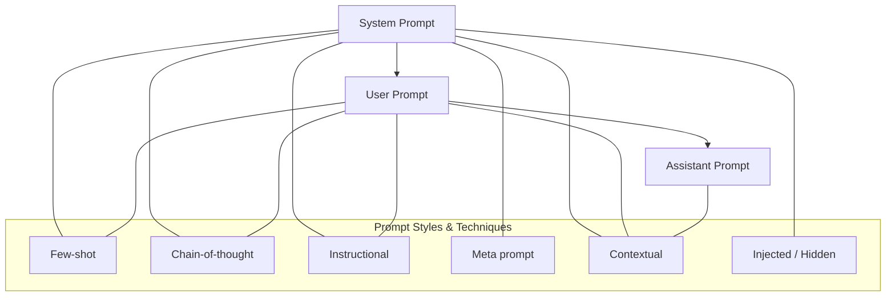

# Prompt Types and Styles in AI Conversations

## Core Prompt Types

In every conversation with an AI like ChatGPT, there are three core prompt types. These define **who is speaking**, **when**, and **why**.

| **Prompt Type** | **Who It's From**     | **Purpose**                                      |
|-----------------|------------------------|--------------------------------------------------|
| **System**      | The system/developer   | Defines behaviour, tone, rules                   |
| **User**        | You (the user)         | Asks a question, sets a task, or gives context   |
| **Assistant**   | The AI (response)      | Provides a relevant, helpful response            |

Each prompt plays a role in shaping the conversation. Here's a closer look at how they work:

### System Prompt
- Set behind the scenes (you usually don't see it unless you're customising it).
- Tells the AI how to behave: tone, style, limitations, formatting rules, etc.
- Example content:
  - "You are a candid assistant who avoids jargon."
  - "Respond in Australian English. Be clear, warm, and precise."

### User Prompt
- This is **your input**: a question, task, instruction, or context.
- It’s what you want the AI to respond to.
- Example prompts:
  - "Write a summary of this document in dot points."
  - "Let’s work through this problem step by step."
  - "Here are 3 examples. What would the 4th look like?"

### Assistant Prompt
- The AI’s reply — shaped by the system prompt and user input.
- Carries forward the conversation and adapts to your style.
- Can include tone shifts, markdown, CoT reasoning, etc.

---

## Prompt Styles & Techniques

These aren’t new prompt types. They’re **techniques or formats** used *within* system, user, or assistant prompts to guide the AI’s thinking, style, or behaviour.

| **Style / Technique** | **Used Within**            | **Purpose / Effect**                                      |
|-----------------------|----------------------------|-----------------------------------------------------------|
| **Few-shot**          | User / System              | Teach by example or pattern recognition                   |
| **Chain-of-thought**  | User / System              | Encourage step-by-step reasoning                          |
| **Instructional**     | User / System              | Direct the output format, tone, or structure              |
| **Meta prompt**       | System                     | Define the AI's persona, mindset, or conversational style |
| **Contextual prompt** | All (System/User/Assistant)| Carry memory, history, or reference past inputs           |
| **Injected / Hidden** | System (hidden layer)      | Manage safety, identity, or underlying behaviour silently |

Let’s break those down:

### Few-shot Prompting
Provide a few examples, then ask the AI to follow the pattern. Useful for:
- Pattern recognition
- Teaching formatting
- Getting consistent outputs

**Example**:
```
Q: What’s 2 + 2?
A: 4
Q: What’s the capital of France?
A: Paris
Q: What’s 10 x 5?
A:
```

### Chain-of-Thought (CoT)
Prompt the AI to work through reasoning step by step. Helps with logic, maths, or complex decisions.

**Example**:
> "Let’s break this into steps to understand the issue."

### Instructional Prompts
These guide the structure, format, or style of the response.

**Examples**:
- "Summarise in bullet points."
- "Use markdown."
- "Be brief, but clear."

### Meta Prompts
Define who or what the assistant *is* — its tone, personality, or values.

**Example**:
> "You are a thoughtful and confident assistant who writes with rhythm and clarity."

### Contextual Prompts
Pull in history, memory, or hidden details (e.g. past user instructions or conversation history).

**Example**:
> If you said earlier: "Always write in Australian English," the AI will carry that forward.

### Injected / Hidden Prompts
Invisible to you, but used by the system to apply guardrails or adjust behaviour.
- Control tone, safety, personality.
- You won’t see or modify these.

---

## Summary Diagram

**Conversation Structure:**
```
[System Prompt]  →  defines the assistant’s mindset and rules
      ↓
[User Prompt]    →  your request, instruction, or question
      ↓
[Assistant Prompt] →  AI response (shaped by both above)
```

**Styles** like few-shot, CoT, or instructional can live inside any of those — especially system and user prompts.

---

## Prompt Flowchart 



This visualises how the core prompts connect, and how styles like few-shot or CoT can live inside any part of the structure.

---


